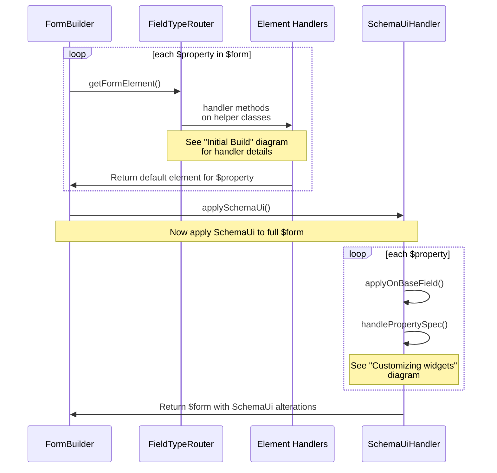
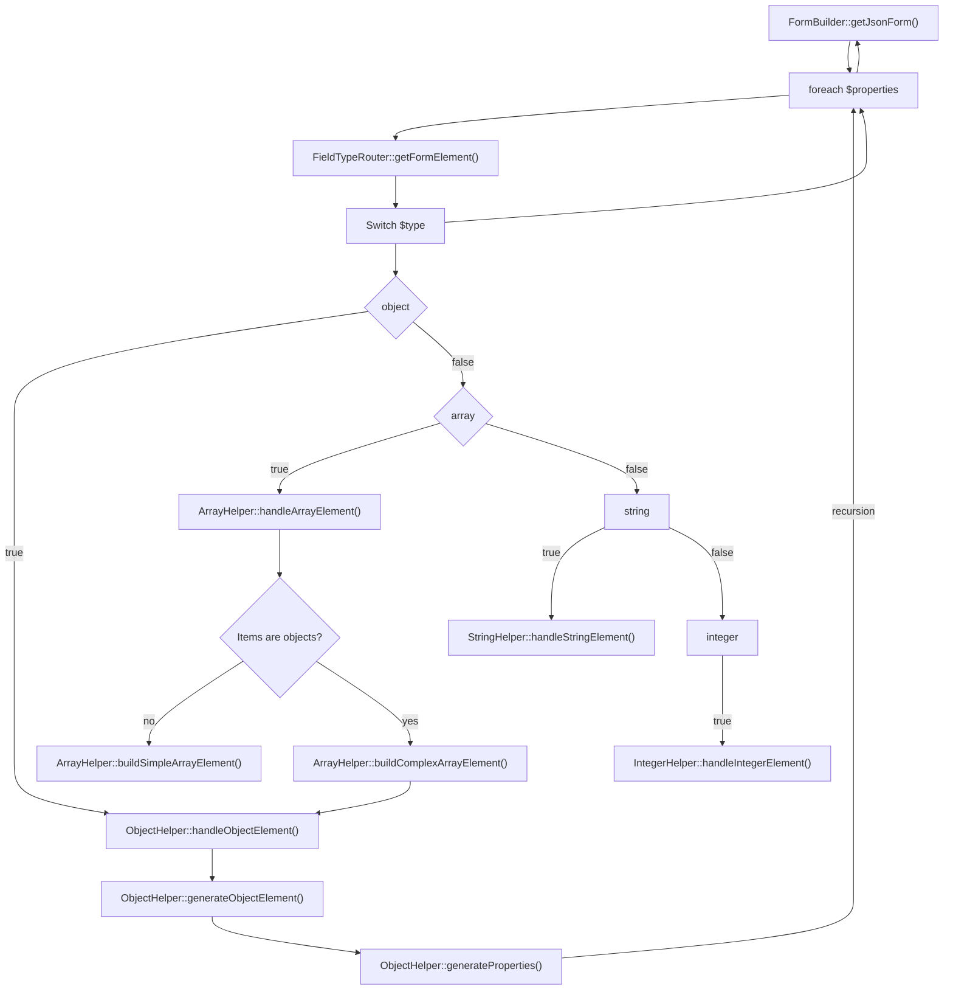
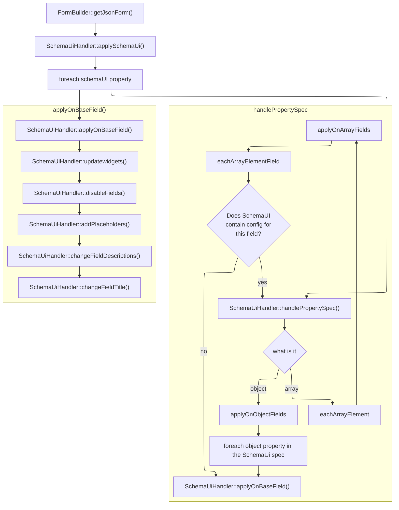

# Code flow diagrams

## High level

```mermaid
sequenceDiagram
  participant FormBuilder
  participant FieldTypeRouter
  participant Element Handlers
  participant SchemaUiHandler

  loop each $property in $form
    FormBuilder ->> FieldTypeRouter: getFormElement()
    FieldTypeRouter ->> Element Handlers: handler methods<br />on helper classes
    Note over FieldTypeRouter, Element Handlers: See "Initial Build" diagram<br />for handler details
    Element Handlers ->> FormBuilder: Return default element for $property
  end

  FormBuilder ->> SchemaUiHandler: applySchemaUi()
  Note over FormBuilder, SchemaUiHandler: Now apply SchemaUi to full $form
  loop each $property
    SchemaUiHandler ->> SchemaUiHandler: applyOnBaseField()
    SchemaUiHandler ->> SchemaUiHandler: handlePropertySpec()
    Note over SchemaUiHandler, SchemaUiHandler: See "Customizing widgets"<br />diagram
  end
  SchemaUiHandler ->> FormBuilder: Return $form with SchemaUi alterations
```

## The initial build

```mermaid
graph TD
  getForm["FormBuilder::getJsonForm()"] --> eachProp["foreach $properties"]
  eachProp --> getElement["FieldTypeRouter::getFormElement()"]
  getElement --> switch[Switch $type]
  switch --> object{object}

  object -- true --> handleObject["ObjectHelper::handleObjectElement()"]
  handleObject --> generateObject["ObjectHelper::generateObjectElement()"]
  generateObject --> generateProperties["ObjectHelper::generateProperties()"]
  generateProperties -- recursion --> eachProp


  object -- false --> array{array}
  array -- true --> handleArray["ArrayHelper::handleArrayElement()"]
  handleArray --> complex{Items are objects?}
  complex -- no --> buildSimple["ArrayHelper::buildSimpleArrayElement()"]
  complex -- yes --> buildComplex["ArrayHelper::buildComplexArrayElement()"]
  buildComplex --> handleObject

  array -- false --> string["string"]
  string -- true --> handleString["StringHelper::handleStringElement()"]
  string -- false --> integer["integer"]
  integer -- true --> handleInteger["IntegerHelper::handleIntegerElement()"]
  switch --> eachProp
  eachProp --> getForm
```

## Customizing widgets w/SchemaUI

```mermaid
flowchart-elk TD
    getForm["FormBuilder::getJsonForm()"] --> applySchemaUi["SchemaUiHandler::applySchemaUi()"]
    applySchemaUi --> eachProp2["foreach schemaUI property"]
    eachProp2 --> applyOnBaseField["SchemaUiHandler::applyOnBaseField()"]
    eachProp2 --> handlePropertySpec
    subgraph s2["handlePropertySpec"]
        handlePropertySpec["SchemaUiHandler::handlePropertySpec()"] --> what{"what is it"}
        what -- array --> eachArrayElement
        eachArrayElement --> applyOnArrayFields

        applyOnArrayFields --> eachArrayElementField
        eachArrayElementField --> inSpec{"Does SchemaUI<br>contain config for<br>this field?"}
        inSpec -- yes --> handlePropertySpec
        inSpec -- no --> applyOnBaseFieldRec["SchemaUiHandler::applyOnBaseField()"]

        what -- object --> applyOnObjectFields
        applyOnObjectFields --> eachObjField["foreach object property in the SchemaUi spec"]
        eachObjField --> applyOnBaseFieldRec
    end
    subgraph s1["applyOnBaseField()"]
        applyOnBaseField --> updateWidgets["SchemaUiHandler::updatewidgets()"]
        updateWidgets --> disableFields["SchemaUiHandler::disableFields()"]
        disableFields --> addPlaceholders["SchemaUiHandler::addPlaceholders()"]
        addPlaceholders --> changeFieldDescriptions["SchemaUiHandler::changeFieldDescriptions()"]
        changeFieldDescriptions --> changeFieldTitle["SchemaUiHandler::changeFieldTitle()"]
    end
```
